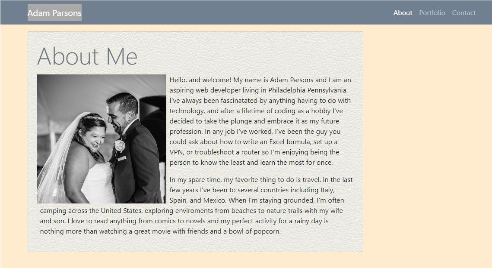

# Project Title
Updated Portfolio - Week 8 Homework

# Motivation 
This homework file will serve as a future page for a collection of projects created during Penn's Coding Boot Camp and allow practice in coding responsive web design using Boot Strap.

Updated 04/19/2020
THe content of the portfolio page has been updated to include links to completed projects in both source code and deployed pages. Additionally, the contact information in the footer has been modified to include updated references and can serve as a public facing prescence for presenting to recruiters.

# Code Style
This project is written using HTML and CSS Bootstrap framework

# Screenshots

About Me

Portfolio

Rejected Input

# Features
Nav bar is dyanmic, shifting content to right at large view points, left at medium view points, and collapsing at small viewpoints. Nav bar is also sticky and does not move. Columns on profile page collapse below large viewpoints for easier viewing. Content is justified left at large view points and centered at lower view poiints. Portfolio page has links to deployed applications in the screenshot displayed and Github repo in the title. 

# Code Example
    <header class="sticky-top">
        <!--Container is used to allow link elements justified to end  -->
        

            <!-- expand above small break point. left padding removed for content alignment -->
            <nav class="navbar navbar-expand-sm navbar-dark pl-0  h-100">
                <!-- left margin expanded to align content -->
                <a class=" navbar-brand ml-5  " href="#" style="background-color:darkgrey">Adam
                    Parsons</a>
                <button class="navbar-toggler" type="button" data-toggle="collapse" data-target="#navbarNav"
                    aria-controls="navbarNav" aria-expanded="false" aria-label="Toggle navigation">
                    
                </button>

# How to Use
Links on nav bar direct to each relevant page. Submit button opn contact page does not currently function.

https://ravalash.github.io/homework-2/index.html

